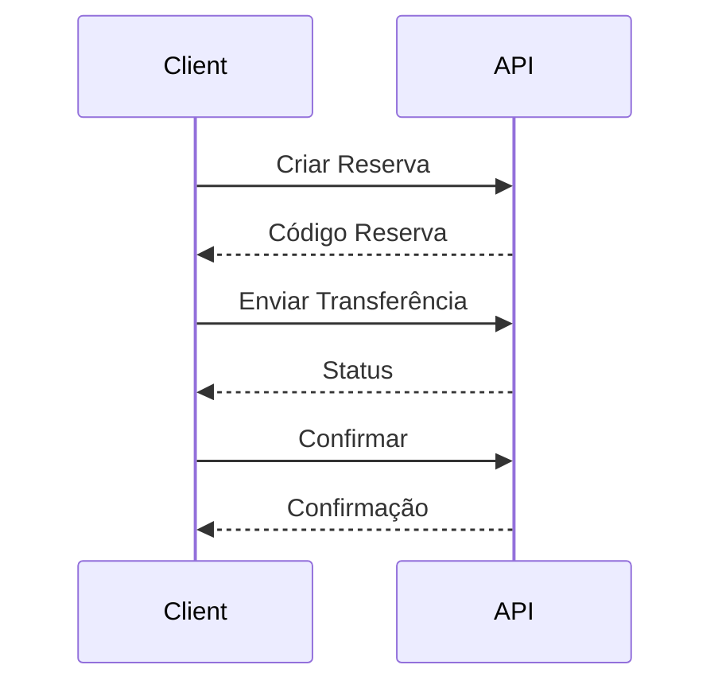

# Arquitetura do Sistema

## 1. Visão Geral

### 1.1 Frontend (React)
```
/frontend
├── /src
│   ├── /components    # Componentes reutilizáveis
│   ├── /pages        # Páginas da aplicação
│   ├── /services     # Serviços e APIs
│   ├── /store        # Estado global (Redux)
│   └── /utils        # Utilitários
```

### 1.2 Backend (Node.js)
```
/backend
├── /controllers      # Controladores
├── /models          # Modelos de dados
├── /routes          # Rotas da API
├── /services        # Serviços
└── /utils           # Utilitários
```

## 2. Componentes

### 2.1 Páginas do Cliente
- **Dashboard**: Visão geral da conta
- **TransferFunds**: Transferências
- **TransactionHistory**: Histórico
- **Profile**: Perfil do usuário

### 2.2 Páginas do Admin
- **Dashboard**: Painel administrativo
- **AccountManagement**: Gerenciar contas
- **TransactionMonitoring**: Monitorar transferências
- **SystemSettings**: Configurações

### 2.3 Componentes Compartilhados
- **TransferForm**: Formulário de transferência
- **AccountOverview**: Visão geral da conta
- **NotificationSystem**: Sistema de notificações

## 3. Estado Global (Redux)

### 3.1 Slices
- **auth**: Autenticação
- **account**: Dados da conta
- **transaction**: Transferências
- **reservation**: Reservas
- **notification**: Notificações
- **settings**: Configurações

### 3.2 Fluxo de Dados
1. User Action
2. Redux Dispatch
3. API Call
4. State Update
5. UI Update

## 4. APIs

### 4.1 Fluxo de Transferência


### 4.2 Serviços
- **reservationApi**: Gerencia reservas
- **sendApi**: Envia transferências
- **confirmationApi**: Confirma transferências
- **receivingApi**: Recebe transferências

## 5. Segurança

### 5.1 Autenticação
- Chave de API
- Tokens por operação
- Validação de conta

### 5.2 Proteção
- Isolamento de contas
- Validação de moeda
- Confirmação em duas etapas
