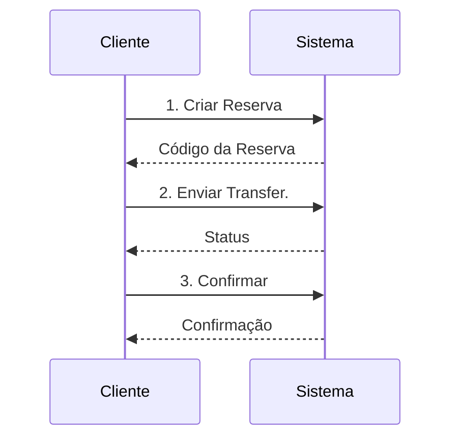

# Escopo do Sistema Bancário

## 1. Visão Geral

Sistema de transferências internacionais com suporte a:
- USD (Dólar Americano)
- EUR (Euro)

## 2. Contas do Sistema

### 2.1 Contas Disponíveis
```javascript
CONTAS = {
  USD: '42226',  // Conta para operações em Dólar
  EUR: '42227'   // Conta para operações em Euro
}
```

### 2.2 Regras das Contas
- Cada cliente tem UMA conta (USD ou EUR)
- Cliente com conta USD só opera em USD
- Cliente com conta EUR só opera em EUR
- Cliente só vê suas próprias transações

## 3. Fluxo de Transferência

### 3.1 Etapas
1. **Criar Reserva**
   - Sistema gera código de reserva
   - Bloqueia o valor temporariamente

2. **Enviar Transferência**
   - Usa o código da reserva
   - Especifica conta destino e valor

3. **Confirmar Transferência**
   - Confirma usando código da reserva
   - Transferência é efetivada

4. **Receber Transferência**
   - Sistema notifica recebimento
   - Atualiza saldo da conta

### 3.2 Exemplo de Fluxo


## 4. APIs do Sistema

### 4.1 Endpoints
- `/Reservation.asp` - Reservas
- `/Send.asp` - Envios
- `/Reservation_confirmation.asp` - Confirmações
- `/receiving.asp` - Recebimentos

### 4.2 Autenticação
- Key obrigatória em todas chamadas
- Formato: UUID v4
- Exemplo: `6d9bac1b-f685-11ef-a3af-00155d010b18`

## 5. Interface do Usuário

### 5.1 Área do Cliente
- **Dashboard**
  - Saldo atual
  - Últimas transações
  - Atalhos rápidos

- **Transferências**
  - Nova transferência
  - Histórico
  - Status das transferências

- **Perfil**
  - Dados pessoais
  - Configurações
  - Preferências

### 5.2 Área Administrativa
- **Dashboard**
  - Visão geral do sistema
  - Métricas e relatórios
  - Alertas

- **Gestão**
  - Contas
  - Usuários
  - Configurações

- **Monitoramento**
  - Transferências
  - Logs
  - Auditoria

## 6. Segurança

### 6.1 Autenticação
- Login seguro
- Tokens por operação
- Sessões controladas

### 6.2 Autorização
- Perfis de acesso
- Permissões granulares
- Logs de atividade

### 6.3 Dados
- Criptografia
- Mascaramento
- Backups

## 7. Integrações

### 7.1 APIs Externas
- FT Asset Management API
- Serviços bancários
- Sistemas de compliance

### 7.2 Webhooks
- Notificações
- Callbacks
- Status updates

## 8. Requisitos Técnicos

### 8.1 Frontend
- React
- Redux
- Material UI

### 8.2 Backend
- Node.js
- Express
- MongoDB

### 8.3 Infraestrutura
- AWS
- Docker
- CI/CD

## 9. Roadmap

### 9.1 Fase 1 - MVP
- ✅ Autenticação
- ✅ Transferências básicas
- ✅ Dashboard simples

### 9.2 Fase 2 - Evolução
- 🔄 Mais moedas
- 🔄 App mobile
- 🔄 Relatórios avançados

### 9.3 Fase 3 - Expansão
- 📅 API pública
- 📅 White label
- 📅 Marketplace
